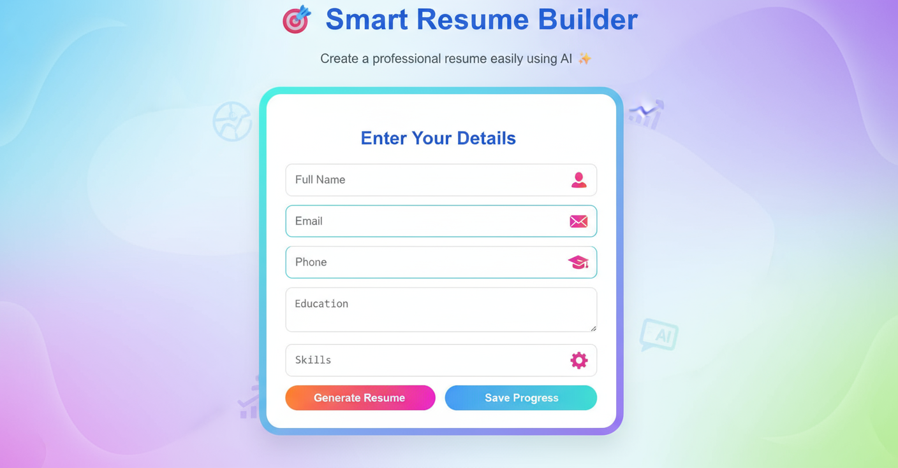
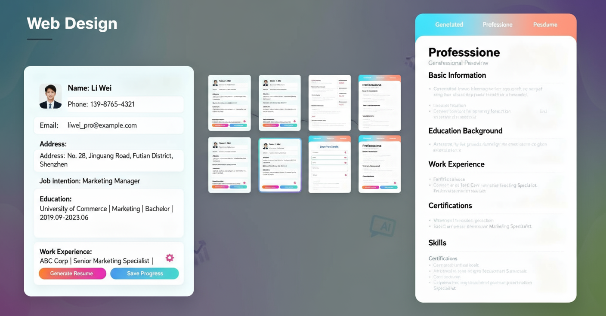

# 🎯 Smart Resume Builder with AI Suggestions  

**Create a professional, AI-enhanced resume in just minutes!**  
A web-based tool built with modern technologies that allows users to enter their details, receive AI-suggested content, and instantly generate visually appealing resumes.  

---

## 🌟 Features  
- 🧠 **AI-Assisted Resume Generation** – Uses OpenAI integration to generate career-focused suggestions.  
- 🎨 **User-Friendly Interface** – Clean, responsive, and colorful UI designed in React.  
- ⚡ **Instant Resume Preview** – Real-time rendering of the filled resume beside the form.  
- 📄 **Download as PDF** – Export beautifully formatted resumes with one click.  
- ☁️ **Cloud Storage Ready** – Built to integrate with backend APIs and databases for user data saving.  

---

## 🏗️ System Architecture  
The system follows a three-tier architecture:  
1. **Frontend (React.js)** – Handles UI rendering and form data validation.  
2. **Backend (Node.js + Express.js)** – Processes user inputs and communicates with the AI model.  
3. **Database (MongoDB)** – Stores user profiles and generated resumes.  

---

## 🖼️ Output Preview  
Below are snapshots of the Smart Resume Builder interface and generated output:  

  
*User fills out the form on the left and views the AI-generated resume preview on the right.*

---

  
*Enhanced and colorful interface showing filled form with live generated resume, highlighting system usability and output quality.*

---

## 🧩 Tech Stack  
| Layer | Technology Used |
|-------|-----------------|
| Frontend | React.js, HTML5, CSS3 |
| Backend | Node.js, Express.js |
| Database | MongoDB |
| AI Integration | OpenAI API |
| Styling | TailwindCSS / Bootstrap |
| Hosting | GitHub Pages / Render / Vercel |

---

## 🚀 Installation  

## Clone the repository
git clone https://github.com/<your-username>/Smart-Resume-Builder-AI.git

Navigate into the project
cd Smart-Resume-Builder-AI

Install dependencies
npm install

Run the application locally
npm start

Then open [[**http://localhost:3000**](http://localhost:3000)](http://localhost:3000) in your browser.

---

## 📚 How It Works  
1. Fill in your personal and professional details in the input form.  
2. The AI model suggests optimized phrases for each section.  
3. A formatted resume is instantly generated beside the form.  
4. You can preview, adjust, and **download the resume as PDF**.  

---

## 🧑‍💻 Contributors  
- **Deepika Lakshmi S** – Developer & Project Owner  
- **ACS College of Engineering** – Project Guidance

---

## 🏁 Future Enhancements  
- Integration with LinkedIn for skill import  
- Multiple resume template styles  
- Dark/light mode customization  
- Mobile application version  

---

## 📧 Contact  
If you like this project or want to collaborate, feel free to reach out:  
📮 **Email:** [yourname@example.com](mailto:deepikalakshmiS94@gmail.com)  
💼 **GitHub:** [your-username](https://github.com/Deepu0808)  